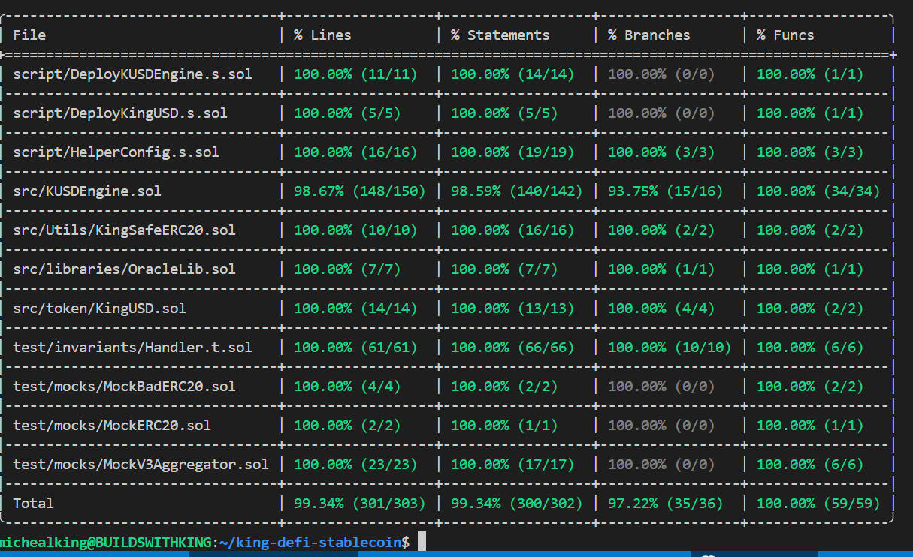

# KingUSD Stablecoin Protocol

[](https://choosealicense.com/licenses/mit/)
[](https://docs.soliditylang.org)
[](https://book.getfoundry.sh/)

> A decentralized, overcollateralized stablecoin protocol maintaining a 1:1 USD peg through algorithmic minting and burning mechanisms.

KingUSD (KUSD) is a dollar-pegged stablecoin backed by wrapped ETH (wETH) and wrapped BTC (wBTC) collateral. The protocol enforces a minimum 200% collateralization ratio through automated health factor monitoring and incentivized liquidations.

## Table of Contents

- [Features](#features)
- [Architecture](#architecture)
- [Getting Started](#getting-started)
- [Usage](#usage)
- [Testing](#testing)
- [Contract Deployment](#contract-deployment)
- [Security Considerations](#security-considerations)
- [Contributing](#contributing)
- [License](#license)

## Features

- **Exogenous Collateral**: Accepts wETH and wBTC as collateral assets
- **Chainlink Oracle Integration**: Real-time price feeds with staleness checks
- **Health Factor System**: Maintains 200% minimum collateralization (HF ≥ 1.0)
- **Incentivized Liquidations**: 15% liquidation bonus for debt clearance
- **Permissionless Operations**: Public mint/burn/liquidate functions
- **Comprehensive Testing**: Unit, integration, and invariant test coverage
- **Gas Optimized**: Efficient Solidity patterns with Foundry optimization

## Architecture

### Core Contracts

**KUSDEngine** - Primary protocol logic handling collateral deposits, KUSD minting/burning, and liquidations

**KingUSD** - ERC20 stablecoin token with mint/burn capabilities controlled by KUSDEngine

### Key Mechanisms

**Health Factor Calculation:**
```
HF = (collateralValueUSD × LIQUIDATION_THRESHOLD / LIQUIDATION_PRECISION) × 1e18 / totalKUSDMinted
```

Where:
- `LIQUIDATION_THRESHOLD` = 50 (represents 50%)
- `LIQUIDATION_PRECISION` = 100
- Minimum HF = 1e18 (enforces 200% overcollateralization)

**Collateral-to-Debt Ratio:**
- Users must maintain at least $2 worth of collateral for every $1 of KUSD minted
- Positions below this threshold become liquidatable
- Liquidators receive collateral value + 15% bonus

**Oracle Price Normalization:**
- All prices normalized to 18 decimal precision
- Supports price feeds with varying decimal configurations
- Automatic scaling prevents precision loss in calculations

### Security Features

- **Reentrancy Protection**: `nonReentrant` modifiers on state-changing functions
- **Access Control**: Restricted mint/burn permissions
- **Input Validation**: Comprehensive checks on amounts and addresses
- **Oracle Staleness Checks**: Rejects outdated price data via `OracleLib`
- **Decimal Overflow Prevention**: Reverts on decimals > 77 to prevent uint256 overflow
- **Zero-Price Protection**: Reverts if oracle returns price ≤ 0

## Getting Started

### Prerequisites

- [Foundry](https://book.getfoundry.sh/getting-started/installation) - Ethereum development toolchain
- [Git](https://git-scm.com/) - Version control

### Installation
```bash
# Clone repository
git clone https://github.com/BuildsWithKing/king-defi-stablecoin.git
cd king-defi-stablecoin

# Install dependencies
forge install

# Build contracts
forge build
```

### Environment Setup

Create `.env` file in project root:
```env
SEPOLIA_RPC_URL=your_sepolia_rpc_url
ETHERSCAN_API_KEY=your_etherscan_api_key
```

## Usage

### Basic Operations

**Deposit Collateral and Mint KUSD:**
```solidity
// Approve wETH spending
IERC20(weth).approve(address(kusdEngine), 10 ether);

// Deposit 10 wETH and mint 5000 KUSD (assuming wETH = $3000)
kusdEngine.depositCollateralAndMintKusd(weth, 10 ether, 5000e18);
```

**Redeem Collateral:**
```solidity
// Burn KUSD and redeem collateral
kusdEngine.redeemCollateralForKusd(weth, 1 ether, 500e18);
```

**Liquidate Undercollateralized Position:**
```solidity
// Approve KUSD for liquidation payment
IERC20(kusd).approve(address(kusdEngine), debtToCover);

// Liquidate user's position
kusdEngine.liquidate(weth, userAddress, debtToCover);
```

### Deployment

Deploy to Sepolia testnet:
```bash
forge script script/DeployKUSDEngine.s.sol:DeployKUSDEngine \
    --rpc-url $SEPOLIA_RPC_URL \
    --broadcast \
    --verify \
    --etherscan-api-key $ETHERSCAN_API_KEY
```

## Testing

### Test Structure
```
test/
├── unit/           # Unit tests for individual functions
├── integration/    # Integration tests for multi-contract flows
├── invariant/      # Fuzz tests for protocol invariants
└── mocks/          # Mock contracts for testing
```

### Running Tests
```bash
# Run all tests
forge test

# Run with verbosity
forge test -vvv

# Run specific test file
forge test --match-path test/unit/KUSDEngineTest.t.sol

# Run with gas reporting
forge test --gas-report

# Generate coverage report
forge coverage

# Run invariant tests
forge test --match-path test/invariants/Invariants.t.sol
```

### Test Coverage
Current test coverage: *99.34%*


Key test scenarios:
- ✅ Collateral deposit/redemption flows
- ✅ KUSD minting/burning mechanics
- ✅ Health factor calculations
- ✅ Liquidation logic and bonuses
- ✅ Oracle price edge cases (negative, zero, stale)
- ✅ Reentrancy attack vectors
- ✅ Access control restrictions
- ✅ Decimal precision handling

### Invariant Testing

Protocol maintains these invariants:
1. **Overcollateralization**: `totalCollateralValue >= totalKUSDSupply × 2`
2. **Health Factor Integrity**: No user with KUSD debt has HF < 1.0
3. **Token Accounting**: Sum of user deposits equals protocol's token balance
4. **Price Consistency**: Oracle prices always positive and non-stale

## Security Considerations

### Known Limitations

1. **100% Collateralization Risk**: If protocol falls to exactly 100% collateralization due to rapid price drops, liquidations may become uneconomical

2. **Oracle Dependency**: Protocol security relies entirely on Chainlink price feed accuracy and timeliness

3. **Single-Block Liquidation**: Large positions cannot be partially liquidated across multiple blocks

4. **Gas Price Sensitivity**: High gas costs may prevent liquidations during network congestion

### Recommended Practices

- Always maintain health factor > 1.5 for safety buffer
- Monitor collateral prices and adjust positions proactively
- Use `getHealthFactor()` before large redemptions
- Consider gas costs when liquidating small positions

### Audit Status

**⚠️ NOT AUDITED** - Do not deploy to mainnet or use with real funds without professional security audit.

## Code Quality

### Linting and Formatting
```bash
# Format code
forge fmt

# Run linter
forge lint

# Check style compliance
forge fmt --check
```

### Coding Standards

- NatSpec documentation on all public interfaces
- Mixed case for variables (`collateralAmount`)
- Screaming snake case for constants (`LIQUIDATION_THRESHOLD`)
- Internal functions prefixed with underscore (`_healthFactor`)
- Events emitted for all state changes

## Contract Deployment

**Sepolia Testnet** 
- *KUSD Contract Address*: 0xd1CE9562E2Ea204FC41453986CE6f8800c7510ac [Sepolia Verified](https://sepolia.etherscan.io/address/0xd1CE9562E2Ea204FC41453986CE6f8800c7510ac)     
- *KUSDEngine Contract Address*: 0xb0af04eb3ff42f3edddaf362b185d61e0170f0f1 [Sepolia Verified](https://sepolia.etherscan.io/address/0xb0af04eb3ff42f3edddaf362b185d61e0170f0f1)

## Contributing

Contributions are welcome! Please follow these guidelines:

1. **Fork** the repository
2. **Create** a feature branch (`git checkout -b feature/AmazingFeature`)
3. **Write tests** for new functionality
4. **Ensure** all tests pass (`forge test`)
5. **Format** code (`forge fmt`)
6. **Commit** changes (`git commit -m 'Add AmazingFeature'`)
7. **Push** to branch (`git push origin feature/AmazingFeature`)
8. **Open** a Pull Request

### Code Review Checklist

- [ ] All tests passing
- [ ] Code formatted with `forge fmt`
- [ ] NatSpec documentation added
- [ ] Gas optimization considered
- [ ] Security implications reviewed

## Resources

- [Foundry Book](https://book.getfoundry.sh/)
- [Solidity Documentation](https://docs.soliditylang.org/)
- [Chainlink Price Feeds](https://docs.chain.link/data-feeds/price-feeds)
- [MakerDAO Technical Docs](https://docs.makerdao.com/)

## License

This project is licensed under the MIT License - see the [LICENSE](LICENSE) file for details.

## Acknowledgments

- Inspired by [MakerDAO](https://makerdao.com/)'s DAI stablecoin architecture
- Built with [Foundry](https://github.com/foundry-rs/foundry) toolkit
- Uses [Chainlink](https://chain.link/) decentralized oracles
- Security patterns from [OpenZeppelin](https://www.openzeppelin.com/)

## Contact

**BuildsWithKing** - [@BuildsWithKing](https://twitter.com/BuildsWithKing)

Project Link: [https://github.com/BuildsWithKing/king-defi-stablecoin](https://github.com/BuildsWithKing/king-defi-stablecoin)

---